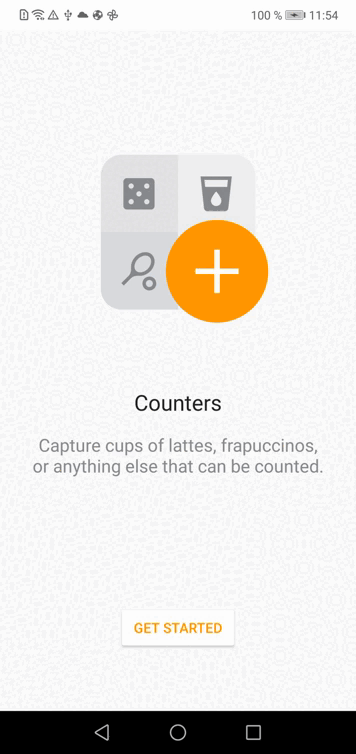
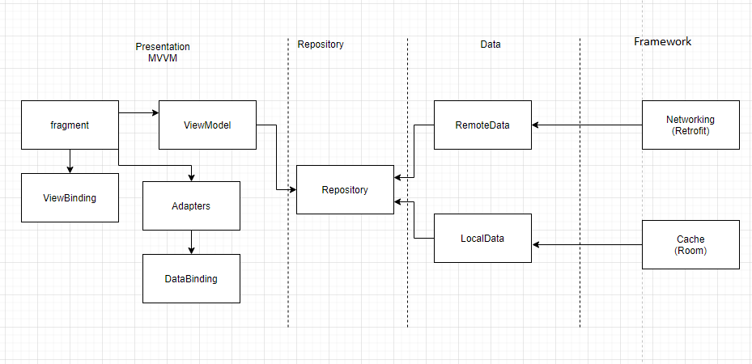

# Architecture Components

## How it looks

    

  

## Architecture  

There are three main layers:  

data: in this module has all details Service and Database

repository : his responsibility is to sync server data with the local, taking as one source of true the database (Room)

presentation: This module has all android framework using MVVM

framework: this module separate the external libraries from the other layers, in this case retrofit and room.

  

## Troubleshooting
  

if you get an error running Android app remember change direction ip in module framework:requestmanager is in the file named APIConstants

  

## Libraries Used :

* [Room](https://developer.android.com/jetpack/androidx/releases/room)

* [Navigation Component](https://codelabs.developers.google.com/codelabs/android-navigation/index.html?index=..%2F..index#0)

* [LiveData](https://developer.android.com/topic/libraries/architecture/livedata)

* [ViewModel](https://developer.android.com/topic/libraries/architecture/viewmodel?gclid=Cj0KCQiA4feBBhC9ARIsABp_nbVSzmSdBQuAKP2WhE9fTRDmz2u67AtgL7wFOrs5kgcNKuqHWPbA3mEaAsSJEALw_wcB&gclsrc=aw.ds)

* [Flow](https://developer.android.com/kotlin/coroutines/additional-resources)

* [MotionLayout](https://developer.android.com/training/constraint-layout/motionlayout)

* [Data Binding](https://codelabs.developers.google.com/codelabs/android-databinding/index.html?index=..%2F..index#5)

* [View Binding](https://developer.android.com/topic/libraries/view-binding)

* [Retrofit2](https://square.github.io/retrofit/)

* [Coroutines](https://developer.android.com/kotlin/coroutines)

* [Mockito-Kotlin](https://github.com/mockito/mockito-kotlin#mockito-kotlin)

  
  
